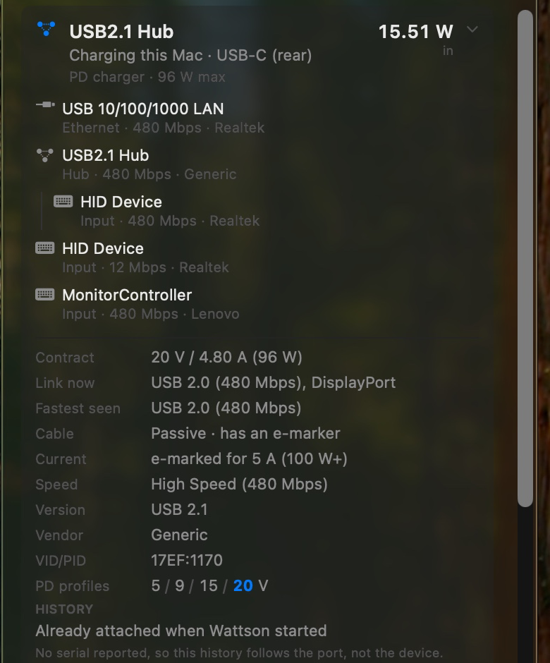

# Wattson

A macOS menu bar app that shows where your Mac's power is actually going, and what
is on the other end of each USB-C cable.

Reads the SMC and the IORegistry directly — `system_profiler SPUSBDataType` returns
an empty list on recent macOS, so it cannot be relied on.


Above: charging at 19.74 W through a dock on the rear port, while a hub on the
front port draws 2.89 W, each with its tree of devices below it.

## What it shows

- **Live wattage** arriving from the charger, or leaving the battery, in the menu bar
  and at the top of the panel.
- **Where that power goes** — a single stacked bar splitting the Mac's own draw,
  attached accessories, and charge going into the battery, sized against what the
  charger can actually supply.
- **One card per physical connection.** A port and the device on the end of it are
  the same cable, so they get one card: what it is, which port, what is flowing and
  in which direction. Expand a card for the PD contract, the voltage ladder, how the
  cable is wired, and what it is certified to carry.
- **Cable diagnostics** — whether a cable has SuperSpeed lanes and sideband pins at
  all, which is usually the answer to "why is this drive slow".
- **What each device is.** Click any device in the tree for its power allocation in
  mA as well as watts, its link speed, vendor, VID/PID and serial number.
- **Volumes.** A drive mounted from a USB device is listed under it with its free
  space, a Show in Finder button, and an eject that unmounts the whole disk rather
  than one partition of a two-partition stick.
- **Connection history**, and optionally a small notice as things are plugged in and
  pulled out — off by default, in Settings.
- **Search**, once the tree is long enough to need it.

<table>
<tr>
<td valign="top"></td>
<td valign="top"></td>
</tr>
</table>

Left: a card expanded onto the cable and the contract carrying the power. This
dock reports no serial, so the panel says its history follows the port rather
than the device, instead of implying one it cannot stand behind. Right: a single
device expanded onto its own power, link, identity and history.

## Building

```bash
./build.sh --install
```

Compiles in release, assembles `Wattson.app`, signs it ad-hoc, copies it to
`/Applications` and launches it. Drop `--install` to just build into `build/`.

Requires macOS 13 or later and a Swift 5.9 toolchain.

## Command line

```bash
Wattson --dump
```

Prints one reading — power, ports, devices — as plain text and exits.

```bash
Wattson --watch
```

Prints the input / load / battery line once a second until interrupted.

## Notes

Port numbering says nothing about physical position, so the mapping from port
number to "front" and "rear" was established by hand on one machine and may not
match yours. The controller-to-port map used to attribute measured power to a
specific device re-learns itself at runtime whenever exactly one port is occupied.

Connection history keys on the device's serial number, so it survives the device
being moved to another port. Plenty of hubs and card readers report no serial at
all; theirs keys on the port instead, and the panel says so rather than implying a
history it cannot stand behind. Nothing is recorded while Wattson is not running.
