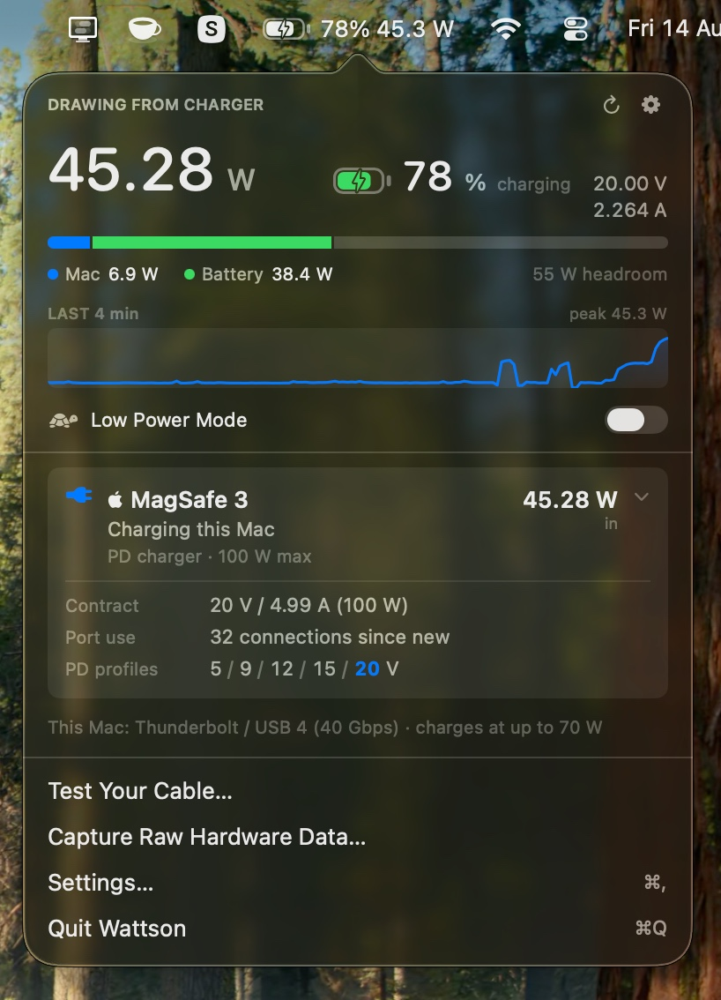
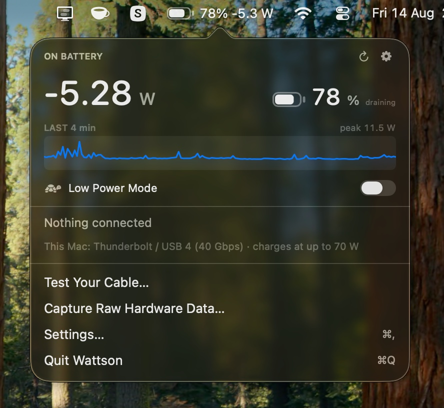
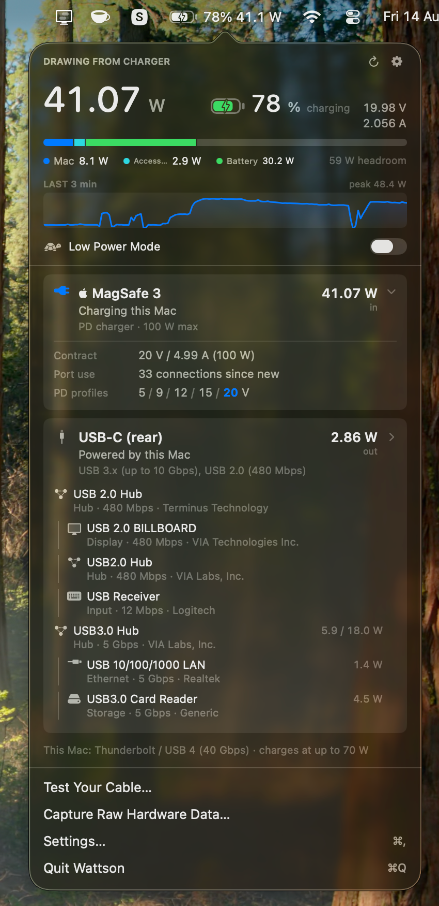
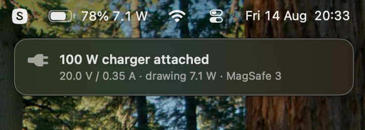
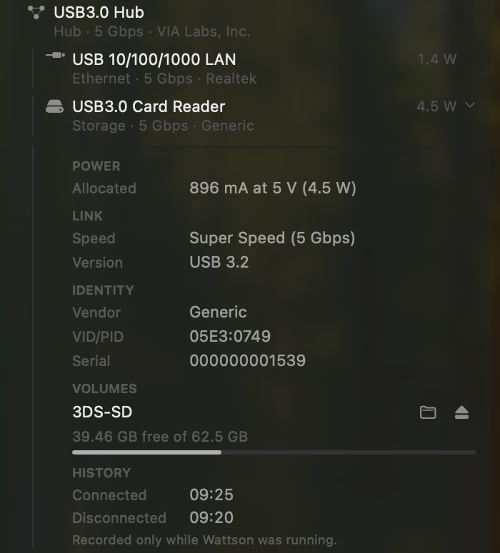

<div align="center">


<h1>Wattson</h1>

<p>
  <strong>A menu bar battery that says what it is actually doing.<br>
  Then keeps going: where every watt lands, and what is on the<br>
  other end of each USB-C cable.</strong>
</p>

<p>
  
  
  
</p>


</div>

Turn off the system's battery item and put this in its place. It is the same
battery, drawn to the same proportions, in the same corner — except that it also
tells you what the machine is drawing, switches Low Power Mode, and opens onto
everything below.

One item instead of two is worth real estate on a 13" menu bar.

<div align="center">
  
</div>

<p align="center">
  <sub>The same item, opened. 45.28 W coming in on a 20 V contract, 38.4 W of it going<br>
  into the cell, 55 W the charger still has spare — and the brick's own account of<br>
  itself underneath.</sub>
</p>

Wattson reads the SMC and the IORegistry directly. `system_profiler SPUSBDataType`
returns an empty list on recent macOS, so nothing here depends on it.

---

## Install

From a clone of this repo:

```bash
./build.sh --install
```

Compiles in release, assembles `Wattson.app`, signs it ad-hoc, copies it to
`/Applications` and launches it. Drop `--install` to just build into `build/`.

Needs an Apple silicon Mac running macOS 13 or later, and a Swift 5.9 toolchain.

> [!TIP]
> The build is signed ad-hoc, so Gatekeeper will refuse the first launch. Right-click
> the app in `/Applications` and choose **Open** once, and it will start normally after that.

To use it as your battery item, set **Menu Bar** in Settings to **Level and
wattage**, then turn the system's own battery off in System Settings ›
Control Center › Battery.

---

## The battery item

- **A battery drawn from the real figure.** SF Symbols ships battery art in five
  steps — 0, 25, 50, 75, 100 — so a symbol can only ever round 61% to the nearest
  quarter. This one is drawn, at the proportions of the battery macOS puts in its
  own menu bar, with the charging bolt cut through the charge the way Apple's is,
  and it turns yellow in Low Power Mode exactly as the system's does.
- **A wattage beside the percentage**, which is the part the system item has never
  told you. **Level and wattage** reads `78% 45.3 W` on a charger — what is arriving
  from the wall — and falls back to the cell's own flow once you unplug.
  **Level and flow** reads `78% +38.4 W` instead, always signed, for what the
  battery itself is doing. Or **Battery level** for the plain percentage, and
  **Icon only** for nothing but the battery.
- **Low Power Mode**, switched from the panel. macOS exposes no API for it at all —
  not in IOKit's headers, not in the PowerManagement plists — so `pmset` is the only
  way in and only root may write it. The first use offers to install
  `/etc/sudoers.d/wattson`, granting your account one command with two exact
  argument lists and nothing else. It is checked with `visudo` before it goes in and
  again once it is there, removed again if that second check fails, and revocable
  from Settings.
- **The charge again in the panel**, at a size you can read across a desk, next to
  what is flowing and which way.

<div align="center">
  
</div>

<p align="center">
  <sub>On battery: what is leaving the cell, and the last four minutes of it.</sub>
</p>

---

## Then everything else

### Power

- **Where that power goes** — a single stacked bar splitting the Mac's own draw,
  attached accessories, and charge going into the battery, sized against what the
  charger can actually supply.
- **What this Mac will take**, so you can tell whether the charger is the thing
  holding you back or the machine is.
- **Which charger it is.** The brick's own name, who made it, its firmware and
  serial — with an Apple mark on the card when the adapter reports Apple as its
  manufacturer.
- **A warning when the battery is going down on a charger**, which is the one
  charging fault nothing else on the machine will tell you about. It reports
  measured facts only — what is coming in against what the Mac is drawing — and
  says nothing about what a bigger charger could have delivered: a small brick
  holding a machine level is doing its job.

### Cables and ports

- **One card per physical connection.** A port and the device on the end of it are
  the same cable, so they get one card: what it is, which port, what is flowing and
  in which direction. Expand a card for the PD contract, the voltage ladder, how
  the cable is wired, and what it is certified to carry.
- **Cable diagnostics** — whether a cable has SuperSpeed lanes and sideband pins at
  all, which is usually the answer to "why is this drive slow".

### Devices

- **What each device is.** Click any device in the tree for its power allocation in
  mA as well as watts, its link speed, vendor, VID/PID and serial number.
- **Volumes.** A drive mounted from a USB device is listed under it with its free
  space, a Show in Finder button, and an eject that unmounts the whole disk rather
  than one partition of a two-partition stick.
- **Connection history**, and **search** once the tree is long enough to need it.

<div align="center">
  
</div>

<p align="center">
  <sub>A port and everything behind it, with what each one is drawing.</sub>
</p>

### Notices

Off by default, switched on by kind in Settings: chargers, drives and cards, or
everything else that plugs in. Each notice carries what is worth knowing rather
than just a name — a drive's free space and link speed, a charger's rating, the
contract it agreed and what it is actually delivering.

Nothing waits and nothing is announced twice: a drive's notice appears the moment
it is on the bus and fills in its size in place when the volume mounts. They show
beside the menu bar, in Notification Center, or both.

<div align="center">
  
</div>

<div align="center">
  
</div>

<p align="center">
  <sub>Clicking a device in the tree expands it where it sits: what the bus granted it, how fast the link<br>
  actually came up, who made it and what its serial is, anything it has mounted, and when it last<br>
  came and went.</sub>
</p>

---

## Command line

The binary lives inside the bundle:

```bash
/Applications/Wattson.app/Contents/MacOS/Wattson --dump
```

| Flag | |
| :--- | :--- |
| `--dump` | Prints one reading — power, ports, devices — as plain text, and exits. |
| `--watch` | Prints the input / load / battery line once a second until interrupted. |

---

## Notes

> [!NOTE]
> **Port positions are guesswork.** Port numbering says nothing about physical
> position, so the mapping from port number to "front" and "rear" was established by
> hand on one machine and may not match yours. The controller-to-port map used to
> attribute measured power to a specific device re-learns itself at runtime whenever
> exactly one port is occupied.

**Maximum charging wattage is the one figure here not read from the hardware.**
macOS publishes a great deal about the adapter attached to a Mac and nothing at
all about what the Mac itself will accept, so that number is a table of Apple's
published ratings keyed on the model identifier. A model missing from the table
reports nothing rather than a guess.

**History keys on the serial number**, so it survives the device being moved to
another port. Plenty of hubs and card readers report no serial at all; theirs keys
on the port instead, and the panel says so rather than implying a history it
cannot stand behind. Nothing is recorded while Wattson is not running.
