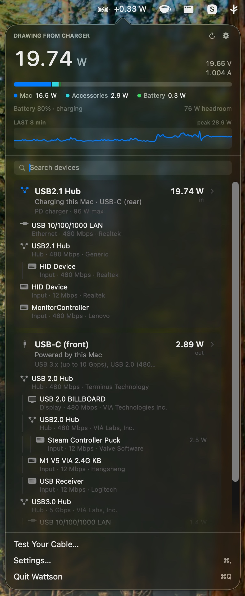

<div align="center">


<h1>Wattson</h1>

<p>
  <strong>Where your Mac's power is actually going,<br>
  and what is on the other end of each USB-C cable.</strong>
</p>

<p>
  
  
  
</p>

</div>

Wattson reads the SMC and the IORegistry directly. `system_profiler SPUSBDataType`
returns an empty list on recent macOS, so nothing here depends on it.

<div align="center">
  
</div>

<p align="center">
  <sub>Charging at 8.83 W on a 20 V / 4.80 A contract. The charger's card is expanded onto its PD<br>
  contract, the cable's own e-marker read off the wire, and the ladder of voltages the charger<br>
  will offer. A dock's tree of devices sits below it.</sub>
</p>

---

## Install

From a clone of this repo:

```bash
./build.sh --install
```

Compiles in release, assembles `Wattson.app`, signs it ad-hoc, copies it to
`/Applications` and launches it. Drop `--install` to just build into `build/`.

Needs an Apple silicon Mac running macOS 13 or later, and a Swift 5.9 toolchain.

> [!TIP]
> The build is signed ad-hoc, so Gatekeeper will refuse the first launch. Right-click
> the app in `/Applications` and choose **Open** once, and it will start normally after that.

---

## What it shows

### Power

- **Live wattage** arriving from the charger, or leaving the battery, in the menu
  bar and at the top of the panel.
- **Where that power goes** — a single stacked bar splitting the Mac's own draw,
  attached accessories, and charge going into the battery, sized against what the
  charger can actually supply.
- **What this Mac will take**, so you can tell whether the charger is the thing
  holding you back or the machine is.
- **Which charger it is.** The brick's own name, who made it, its firmware and
  serial — with an Apple mark on the card when the adapter reports Apple as its
  manufacturer.

### Cables and ports

- **One card per physical connection.** A port and the device on the end of it are
  the same cable, so they get one card: what it is, which port, what is flowing and
  in which direction. Expand a card for the PD contract, the voltage ladder, how
  the cable is wired, and what it is certified to carry.
- **Cable diagnostics** — whether a cable has SuperSpeed lanes and sideband pins at
  all, which is usually the answer to "why is this drive slow".

### Devices

- **What each device is.** Click any device in the tree for its power allocation in
  mA as well as watts, its link speed, vendor, VID/PID and serial number.
- **Volumes.** A drive mounted from a USB device is listed under it with its free
  space, a Show in Finder button, and an eject that unmounts the whole disk rather
  than one partition of a two-partition stick.
- **Connection history**, and optionally a small notice as things are plugged in and
  pulled out — off by default, in Settings.
- **Search**, once the tree is long enough to need it.

<div align="center">
  
</div>

<p align="center">
  <sub>Clicking a device in the tree expands it where it sits: what the bus granted it, how fast the link<br>
  actually came up, who made it and what its serial is, anything it has mounted, and when it last<br>
  came and went.</sub>
</p>

---

## Command line

The binary lives inside the bundle:

```bash
/Applications/Wattson.app/Contents/MacOS/Wattson --dump
```

| Flag | |
| :--- | :--- |
| `--dump` | Prints one reading — power, ports, devices — as plain text, and exits. |
| `--watch` | Prints the input / load / battery line once a second until interrupted. |

---

## Notes

> [!NOTE]
> **Port positions are guesswork.** Port numbering says nothing about physical
> position, so the mapping from port number to "front" and "rear" was established by
> hand on one machine and may not match yours. The controller-to-port map used to
> attribute measured power to a specific device re-learns itself at runtime whenever
> exactly one port is occupied.

**Maximum charging wattage is the one figure here not read from the hardware.**
macOS publishes a great deal about the adapter attached to a Mac and nothing at
all about what the Mac itself will accept, so that number is a table of Apple's
published ratings keyed on the model identifier. A model missing from the table
reports nothing rather than a guess.

**History keys on the serial number**, so it survives the device being moved to
another port. Plenty of hubs and card readers report no serial at all; theirs keys
on the port instead, and the panel says so rather than implying a history it
cannot stand behind. Nothing is recorded while Wattson is not running.
